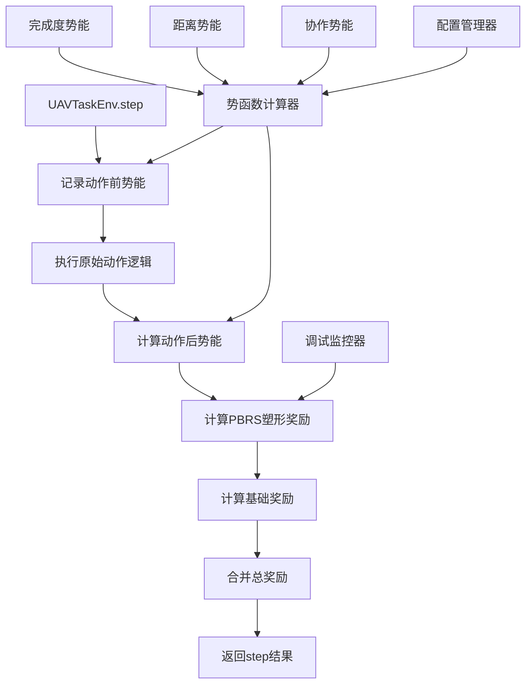

# 设计文档

## 概述

本设计文档描述了基于势函数的奖励塑形（Potential-Based Reward Shaping, PBRS）系统的实现方案。该系统将在现有的UAVTaskEnv环境中集成一个理论上安全的奖励塑形机制，通过定义场景的势函数来提供稠密的学习信号，同时保证不会改变问题的最优策略。

核心设计理念基于Ng等人提出的PBRS理论：对于任何势函数Φ(s)，塑形奖励F(s,a,s') = γΦ(s') - Φ(s)不会改变最优策略，其中γ是折扣因子。这确保了我们的改进在理论上是安全的。

## 架构

### 系统架构图



### 核心组件关系

1. **势函数计算器（Potential Calculator）**：核心组件，负责计算当前状态的势能值
2. **PBRS奖励管理器（PBRS Reward Manager）**：管理塑形奖励的计算和集成
3. **基础奖励系统（Base Reward System）**：简化的稀疏奖励系统
4. **配置管理器（Configuration Manager）**：管理势函数相关的参数配置
5. **调试监控器（Debug Monitor）**：提供势函数行为的监控和分析

## 组件和接口

### 1. 势函数计算器（Potential Calculator）

#### 接口定义
```python
def _calculate_potential(self) -> float:
    """
    计算当前状态的势能值
    
    Returns:
        float: 势能值，状态越好值越高
    """
```

#### 实现策略
势函数由三个主要组成部分构成：

1. **完成度势能（Completion Potential）**
   - 基于所有目标的资源完成度
   - 公式：`completion_potential = (total_demand - total_remaining_demand) * COMPLETION_WEIGHT`
   - 权重：10.0（可配置）

2. **距离势能（Distance Potential）**
   - 基于所有UAV到最近未完成目标的距离
   - 公式：`distance_potential = -sum(min_distances_to_uncompleted) * DISTANCE_WEIGHT`
   - 权重：0.01（可配置）

3. **协作势能（Collaboration Potential）**
   - 基于UAV之间的协作效率
   - 考虑目标分配的均衡性和资源匹配度

### 2. PBRS奖励管理器

#### 接口定义
```python
def _calculate_pbrs_reward(self, potential_before: float, potential_after: float) -> float:
    """
    计算PBRS塑形奖励
    
    Args:
        potential_before: 动作前的势能值
        potential_after: 动作后的势能值
        
    Returns:
        float: 塑形奖励值
    """
```

#### 实现策略
- 使用标准PBRS公式：`shaping_reward = γ * Φ(s') - Φ(s)`
- γ值从配置中获取（默认0.99）
- 提供可选的奖励裁剪机制防止数值不稳定

### 3. 重构的奖励系统

#### 新的奖励结构
```python
total_reward = base_reward + shaping_reward + penalty_adjustments
```

其中：
- `base_reward`：稀疏的基础奖励（仅在任务完成时给予）
- `shaping_reward`：PBRS塑形奖励（提供稠密引导信号）
- `penalty_adjustments`：对绝对错误行为的惩罚

#### 基础奖励简化
- 任务完成：+100.0
- 无效动作：-5.0（覆盖其他奖励）
- 零贡献：-5.0（覆盖其他奖励）
- 其他情况：0.0

### 4. 配置管理接口

#### 新增配置参数
```python
# 在Config类中新增的PBRS相关参数
class Config:
    # PBRS功能开关
    ENABLE_PBRS: bool = True
    
    # 势函数权重参数
    PBRS_COMPLETION_WEIGHT: float = 10.0
    PBRS_DISTANCE_WEIGHT: float = 0.01
    PBRS_COLLABORATION_WEIGHT: float = 5.0
    
    # 奖励裁剪参数
    PBRS_REWARD_CLIP_MIN: float = -50.0
    PBRS_REWARD_CLIP_MAX: float = 50.0
    
    # 调试参数
    PBRS_DEBUG_MODE: bool = False
    PBRS_LOG_POTENTIAL_VALUES: bool = False
```

## 数据模型

### 势函数状态表示

```python
@dataclass
class PotentialState:
    """势函数计算所需的状态信息"""
    completion_potential: float
    distance_potential: float
    collaboration_potential: float
    total_potential: float
    timestamp: float
    debug_info: Dict[str, Any]
```

### 奖励组成信息

```python
@dataclass
class RewardComponents:
    """详细的奖励组成信息，用于调试和分析"""
    base_reward: float
    shaping_reward: float
    potential_before: float
    potential_after: float
    potential_delta: float
    penalty_adjustments: float
    total_reward: float
    debug_breakdown: Dict[str, float]
```

## 错误处理

### 1. 数值稳定性处理

- **势函数值范围检查**：确保势函数值在合理范围内
- **梯度裁剪**：防止势函数变化过大导致的训练不稳定
- **NaN/Inf检测**：检测并处理数值异常情况

### 2. 配置验证

- **参数范围验证**：确保所有权重参数在合理范围内
- **兼容性检查**：验证PBRS配置与现有系统的兼容性
- **运行时验证**：在训练过程中监控势函数行为的合理性

### 3. 降级策略

- **PBRS禁用机制**：当检测到异常时自动禁用PBRS，回退到原始奖励
- **权重自适应调整**：根据训练表现动态调整势函数权重
- **异常恢复**：提供从异常状态恢复的机制

## 测试策略

### 1. 单元测试

- **势函数计算测试**：验证势函数在各种状态下的计算正确性
- **PBRS公式测试**：验证塑形奖励计算的数学正确性
- **边界条件测试**：测试极端情况下的系统行为

### 2. 集成测试

- **环境兼容性测试**：确保新系统与现有环境完全兼容
- **训练稳定性测试**：验证PBRS不会导致训练不稳定
- **性能回归测试**：确保新系统不会显著影响训练性能

### 3. 理论验证测试

- **策略不变性测试**：验证PBRS确实不改变最优策略
- **收敛性测试**：验证使用PBRS的训练能够正常收敛
- **对比实验**：比较使用和不使用PBRS的训练效果

### 4. 监控和分析测试

- **势函数行为分析**：分析势函数在训练过程中的变化模式
- **奖励分布分析**：分析塑形奖励对总奖励分布的影响
- **学习曲线对比**：对比使用PBRS前后的学习曲线差异

## 实现细节

### 1. 势函数计算优化

- **缓存机制**：对重复计算的距离矩阵进行缓存
- **增量计算**：仅重新计算发生变化的部分
- **向量化操作**：使用NumPy向量化操作提高计算效率

### 2. 内存管理

- **状态历史管理**：合理管理势函数值的历史记录
- **调试信息控制**：在非调试模式下减少内存占用
- **垃圾回收优化**：及时清理不需要的中间计算结果

### 3. 性能监控

- **计算时间监控**：监控势函数计算的耗时
- **内存使用监控**：监控PBRS系统的内存占用
- **训练效率监控**：监控PBRS对整体训练效率的影响

### 4. 可扩展性设计

- **模块化架构**：设计为可插拔的模块，便于后续扩展
- **参数化配置**：所有关键参数都可通过配置文件调整
- **接口标准化**：提供标准化的接口供其他组件使用