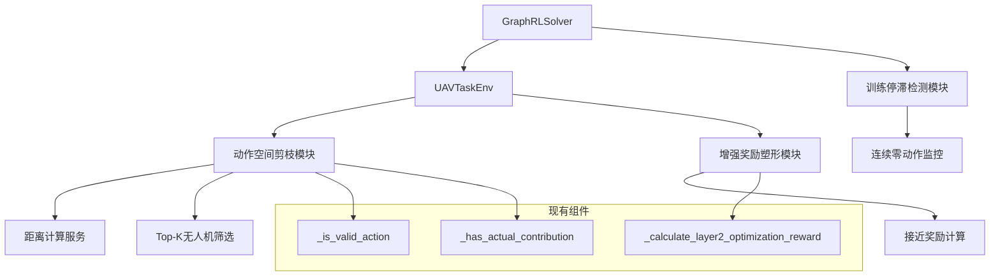

# 强化学习训练流程优化设计文档

## 概述

本设计文档详细描述了无人机任务分配项目中强化学习智能体训练流程的优化方案。优化的核心目标是解决复杂场景下动作空间过大导致的训练停滞问题，通过三个主要技术手段：基于距离的动作空间剪枝、增强的奖励塑形机制和智能的提前终止策略。

## 架构

### 当前系统架构分析

当前系统采用以下架构：
- **环境层**: `UAVTaskEnv` 类管理无人机和目标的状态，提供强化学习环境接口
- **求解器层**: `GraphRLSolver` 类实现基于深度Q网络的强化学习算法
- **网络层**: 支持多种网络架构（DQN、ZeroShotGNN等）
- **实体层**: `UAV` 和 `Target` 类定义基本实体属性和行为

### 优化后的架构设计

优化方案将在现有架构基础上进行增强，不改变核心架构，确保兼容性：



## 组件和接口

### 1. 动作空间剪枝模块

#### 1.1 核心组件设计

**位置**: `environment.py` 中的 `get_action_mask` 方法

**新增配置参数**:
```python
self.top_k_uavs = 5  # 可配置的K值，表示每个目标考虑的最近无人机数量
```

**核心算法流程**:
1. **资源筛选阶段**: 创建有资源的无人机列表
2. **距离计算阶段**: 计算每个目标与所有活跃无人机的距离
3. **Top-K筛选阶段**: 为每个目标选择距离最近的K架无人机
4. **有效性验证阶段**: 对筛选后的动作子集应用现有验证逻辑

#### 1.2 接口设计

```python
def get_action_mask(self):
    """
    生成基于距离剪枝的动作掩码
    
    Returns:
        np.ndarray: 布尔型数组，形状为(n_actions,)
    """
    # 实现基于距离的剪枝逻辑
    pass

def _get_top_k_uavs_for_target(self, target, k=None):
    """
    为指定目标获取距离最近的K架有资源无人机
    
    Args:
        target: 目标对象
        k: 选择的无人机数量，默认使用self.top_k_uavs
        
    Returns:
        list: 按距离排序的无人机列表（最多K个）
    """
    pass
```

### 2. 增强奖励塑形模块

#### 2.1 核心组件设计

**位置**: `environment.py` 中的 `_calculate_layer2_optimization_reward` 方法

**新增奖励组件**: "接近激励"奖励
- **计算公式**: `接近奖励 = 0.001 * max(0, 距离缩短量)`
- **适用条件**: 无人机拥有目标所需资源
- **集成方式**: 添加到现有的breakdown字典中

#### 2.2 接口设计

```python
def _calculate_approach_reward(self, target, uav, previous_distance, current_distance):
    """
    计算接近奖励
    
    Args:
        target: 目标对象
        uav: 无人机对象
        previous_distance: 之前的距离
        current_distance: 当前距离
        
    Returns:
        float: 接近奖励值
    """
    pass

def _has_required_resources(self, target, uav):
    """
    检查无人机是否拥有目标所需的资源类型
    
    Args:
        target: 目标对象
        uav: 无人机对象
        
    Returns:
        bool: 是否拥有所需资源
    """
    pass
```

### 3. 训练停滞检测模块

#### 3.1 核心组件设计

**位置**: `solvers.py` 中的 `GraphRLSolver.train` 方法

**检测机制**:
- **监控指标**: 连续零动作计数
- **阈值设置**: 15次连续零动作
- **响应策略**: 设置truncated=True并终止当前轮次

#### 3.2 接口设计

```python
def _check_training_stagnation(self, action, consecutive_zero_actions):
    """
    检查训练是否停滞
    
    Args:
        action: 当前选择的动作
        consecutive_zero_actions: 当前连续零动作计数
        
    Returns:
        tuple: (更新后的计数, 是否应该终止)
    """
    pass

def _log_early_termination(self, episode_num, consecutive_count):
    """
    记录提前终止信息
    
    Args:
        episode_num: 轮次编号
        consecutive_count: 连续零动作次数
    """
    pass
```

## 数据模型

### 1. 距离计算数据结构

```python
# 无人机-目标距离矩阵
distance_matrix: np.ndarray  # shape: (n_uavs, n_targets)

# Top-K筛选结果
target_uav_mapping: Dict[int, List[Tuple[int, float]]]
# 格式: {target_id: [(uav_id, distance), ...]}
```

### 2. 奖励分解数据结构

```python
# 扩展的奖励分解字典
breakdown = {
    '任务完成': float,
    '协同增效': float,
    '路径效率': float,
    '时间效率': float,
    '资源浪费': float,
    '进度奖励': float,
    '接近奖励': float,  # 新增组件
}
```

### 3. 训练状态监控数据结构

```python
# 训练状态跟踪
training_state = {
    'consecutive_zero_actions': int,
    'episode_number': int,
    'stagnation_threshold': int,  # 默认15
    'early_termination_count': int,
}
```

## 错误处理

### 1. 动作空间剪枝错误处理

- **距离计算失败**: 回退到原始的全动作空间掩码生成
- **Top-K筛选异常**: 使用所有可用无人机作为备选
- **索引越界**: 添加边界检查和安全的索引访问

### 2. 奖励计算错误处理

- **距离计算异常**: 接近奖励设为0，不影响其他奖励组件
- **资源检查失败**: 跳过接近奖励计算，记录警告日志
- **数值溢出**: 添加数值范围检查和截断机制

### 3. 训练监控错误处理

- **动作解析失败**: 使用默认的非零动作处理逻辑
- **日志记录失败**: 继续训练流程，记录错误但不中断
- **状态重置异常**: 确保计数器能够正确重置

## 测试策略

### 1. 单元测试

- **动作空间剪枝测试**: 验证Top-K筛选的正确性和边界情况
- **奖励计算测试**: 验证接近奖励的计算逻辑和边界条件
- **停滞检测测试**: 验证连续零动作计数和终止逻辑

### 2. 集成测试

- **端到端训练测试**: 验证优化后的训练流程完整性
- **性能对比测试**: 对比优化前后的训练效率和收敛性
- **兼容性测试**: 确保与现有网络架构和配置的兼容性

### 3. 性能测试

- **动作空间缩减效果**: 测量剪枝后的动作空间大小减少比例
- **训练速度提升**: 测量每轮训练时间的改善程度
- **收敛性改善**: 测量达到目标性能所需的训练轮次

### 4. 回归测试

- **现有功能验证**: 确保所有现有功能保持正常工作
- **配置兼容性**: 验证不同配置下的系统稳定性
- **边界情况处理**: 测试极端场景下的系统行为

## 实现优先级

### 阶段1: 动作空间剪枝（高优先级）
- 实现基于距离的Top-K筛选算法
- 集成到现有的动作掩码生成流程
- 添加配置参数和边界检查

### 阶段2: 奖励塑形增强（中优先级）
- 实现接近奖励计算逻辑
- 集成到现有奖励系统
- 添加资源匹配检查

### 阶段3: 训练停滞检测（中优先级）
- 实现连续零动作监控
- 添加提前终止机制
- 完善日志记录

### 阶段4: 测试和优化（低优先级）
- 完善单元测试和集成测试
- 性能调优和参数优化
- 文档更新和代码清理

## 配置参数

### 新增配置项

```python
# 动作空间剪枝配置
TOP_K_UAVS = 5  # 每个目标考虑的最近无人机数量

# 奖励塑形配置
APPROACH_REWARD_COEFFICIENT = 0.001  # 接近奖励系数

# 训练停滞检测配置
STAGNATION_THRESHOLD = 15  # 连续零动作阈值
ENABLE_EARLY_TERMINATION = True  # 是否启用提前终止
```

### 兼容性保证

所有新增配置项都提供默认值，确保在不修改现有配置的情况下系统能够正常运行。