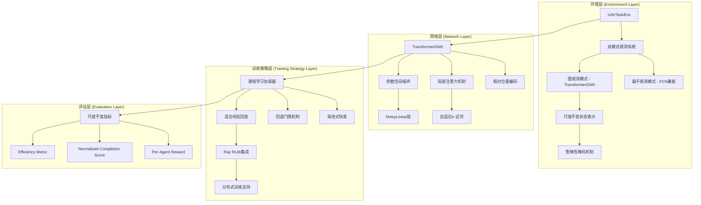

# 设计文档

## 概述

本设计文档详细描述了支持零样本迁移的局部注意力Transformer网络系统的架构设计。该系统基于现有的RL集群任务分配框架，通过引入TransformerGNN架构、课程学习训练策略和尺度不变机制，实现在任意数量无人机/目标场景下的鲁棒零样本迁移。
### 总体要求
- 默认输出中文
- 文件操作默认使用MCP文件系统，不成功再转换
- 整个修改向后兼容
- 所有临时的测试及说明代码归并到temp文件夹中
- **代码质量要求**，所有新实现的代码**必须**包含完整的、清晰的注释。
- **优先使用Ray RLlib**：所有通用算法组件（如经验回放、算法逻辑、分布式执行）**必须**优先使用Ray RLlib库中经过验证的功能。仅在RLlib无法满足特定需求时（如自定义网络架构、环境逻辑）才自编代码。

## 架构

### 系统整体架构



### 核心组件架构

#### 1. 多模式环境系统

**设计原理：** 通过obs_mode参数控制观测模式，确保向后兼容性的同时支持新架构。

**关键设计决策：**
- 使用工厂模式根据obs_mode动态创建观测空间
- 图模式采用gym.spaces.Dict支持可变实体数量
- 状态归一化确保尺度不变性
- 实现鲁棒的输入掩码，为解决通信/感知失效问题，在图模式的状态特征中增加鲁棒性输入掩码，确保在部分可观测情况下仍能稳健输出


**实现策略：**
```python
class UAVTaskEnv:
    def __init__(self, obs_mode: Literal["flat", "graph"] = "flat"):
        if obs_mode == "flat":
            self.observation_space = gym.spaces.Box(...)  # 现有实现
        elif obs_mode == "graph":
            self.observation_space = gym.spaces.Dict({
                "uav_features": gym.spaces.Box(...),
                "target_features": gym.spaces.Box(...),
                "relative_positions": gym.spaces.Box(...),
                "distances": gym.spaces.Box(...),
                "masks": gym.spaces.Dict(...)
            })
```

#### 2. TransformerGNN网络架构

**设计原理：** 结合Transformer的注意力机制和GNN的图结构处理能力，实现排列不变和尺度不变的特征学习。

**核心组件：**

1. **相对位置编码模块**
   - 输入：relative_positions张量
   - 处理：小型MLP生成位置嵌入
   - 输出：加到对应实体特征嵌入上

2. **局部注意力机制**
   - 根据`distances`张量为每架无人机动态选择**`k`个最近的目标**作为其注意力计算的上下文
   - k-近邻选择：基于distances张量动态选择最近k个目标
   - 自适应k值：k = min(max(4, ceil(N/4)), 16)
   - 训练期随机化：k ± 2的随机抖动

3. **参数空间噪声探索**
   - NoisyLinear替换所有nn.Linear层
   - 训练模式：启用噪声探索
   - 推理模式：关闭噪声确保可复现性

**网络结构设计：**
```python
class TransformerGNN(TorchModelV2):
    def __init__(self):
        # 实体编码器
        self.uav_encoder = EntityEncoder(...)
        self.target_encoder = EntityEncoder(...)
        
        # 相对位置编码
        self.pos_encoder = PositionalEncoder(...)
        
        # 局部注意力
        self.local_attention = LocalAttention(k_adaptive=True)
        
        # 输出层
        self.output_layer = NoisyLinear(...)
```

#### 3. 课程学习训练系统

**设计原理：** 通过渐进式训练和智能回退机制，确保模型在复杂场景下的稳定学习。

**训练阶段设计：**
1. **阶段1：** 2-3个UAV，1-2个目标（基础协调）
2. **阶段2：** 4-6个UAV，3-4个目标（中等复杂度）
3. **阶段3：** 8-12个UAV，5-8个目标（高复杂度）
4. **阶段4：** 15+个UAV，10+个目标（极限场景）

**回退门限机制：**
- 监控指标：Normalized Completion Score
- 触发条件：连续3个评估周期性能 < 上阶段最终性能的60%
- 回退策略：降低学习率，重新训练当前阶段

**混合经验回放：**
- 当前阶段经验：70%
- 历史阶段经验：30%
- 防止灾难性遗忘

## 组件和接口

### 1. 环境接口扩展

```python
class UAVTaskEnv:
    def __init__(self, obs_mode: str = "flat", **kwargs):
        """支持双模式初始化"""
        
    def _get_state(self) -> Union[np.ndarray, Dict]:
        """根据模式返回不同格式状态"""
        
    def _calculate_reward(self, **kwargs) -> float:
        """Per-Agent归一化奖励计算"""
```

### 2. TransformerGNN网络接口

```python
class TransformerGNN(TorchModelV2):
    def __init__(self, obs_space, action_space, num_outputs, **kwargs):
        """Ray RLlib兼容的网络初始化"""
        
    def forward(self, input_dict, state, seq_lens):
        """标准RLlib前向传播接口"""
        
    def value_function(self):
        """价值函数估计"""
```

### 3. 课程学习协调器接口

```python
class CurriculumTrainer:
    def __init__(self, config: Dict):
        """初始化课程配置"""
        
    def train_stage(self, stage_config: Dict) -> Dict:
        """单阶段训练"""
        
    def should_advance(self, metrics: Dict) -> bool:
        """判断是否进入下一阶段"""
        
    def should_fallback(self, metrics: Dict) -> bool:
        """判断是否需要回退"""
```

## 数据模型

### 1. 图模式状态结构

```python
GraphState = {
    "uav_features": np.ndarray,      # [N_uav, uav_feature_dim]
    "target_features": np.ndarray,   # [N_target, target_feature_dim]
    "relative_positions": np.ndarray, # [N_uav, N_target, 2]
    "distances": np.ndarray,         # [N_uav, N_target]
    "masks": {
        "uav_mask": np.ndarray,      # [N_uav] - 有效UAV掩码
        "target_mask": np.ndarray,   # [N_target] - 有效目标掩码
    }
}
```

### 2. 课程阶段配置

```python
StageConfig = {
    "stage_id": int,
    "n_uavs_range": Tuple[int, int],
    "n_targets_range": Tuple[int, int],
    "max_episodes": int,
    "success_threshold": float,
    "fallback_threshold": float,
    "learning_rate": float
}
```

### 3. 训练指标结构

```python
TrainingMetrics = {
    "per_agent_reward": float,
    "normalized_completion_score": float,
    "efficiency_metric": float,
    "stage_progress": float,
    "fallback_count": int
}
```

## 错误处理

### 1. 维度不匹配处理

**问题：** 不同场景下实体数量变化导致的张量维度不匹配
**解决方案：** 
- 使用动态填充和掩码机制
- 最大实体数量限制和截断策略
- 优雅降级到较小规模处理

### 2. 分布式训练数据一致性

**问题：** GNN稀疏张量跨进程传输错误
**解决方案：**
- RolloutWorker中张量预处理：`.cpu().share_memory_()`
- Learner中配置：`pin_memory=True`
- 异常捕获和重试机制

### 3. 课程学习失败处理

**问题：** 某阶段训练持续失败或发散
**解决方案：**
- 自动回退到上一成功阶段
- 调整超参数（学习率、批次大小）
- 提供手动干预接口

## 测试策略

### 1. 单元测试

- **环境测试：** 双模式状态生成正确性
- **网络测试：** TransformerGNN前向传播和梯度
- **注意力测试：** 局部注意力机制k-近邻选择
- **掩码测试：** 鲁棒性掩码在失效节点下的行为

### 2. 集成测试

- **端到端训练：** 完整课程学习流程
- **零样本迁移：** 不同规模场景间的性能迁移
- **分布式训练：** 多进程训练稳定性
- **向后兼容性：** FCN模式正常运行

### 3. 性能测试

- **内存使用：** 大规模场景下的内存占用
- **训练速度：** 与基线方法的训练效率对比
- **推理延迟：** 实时决策的响应时间
- **收敛性：** 不同初始化下的收敛稳定性

### 4. 零样本迁移验证

- **规模泛化：** 从小规模训练到大规模测试
- **场景泛化：** 不同障碍物分布和资源配置
- **动态适应：** 运行时实体数量变化
- **鲁棒性：** 部分观测和通信失效场景

## 实现优先级

### 第一优先级（核心功能）
1. 双模式环境系统实现
2. TransformerGNN基础架构
3. 相对位置编码和局部注意力
4. Ray RLlib集成

### 第二优先级（增强功能）
1. 课程学习协调器
2. 混合经验回放机制
3. 尺度不变评价指标
4. 分布式训练支持

### 第三优先级（优化功能）
1. 参数空间噪声探索
2. 自适应k值和随机化
3. 高级回退门限机制
4. 性能监控和可视化

## 技术风险和缓解策略

### 1. 内存和计算复杂度风险
**风险：** 大规模场景下的内存爆炸和计算瓶颈
**缓解：** 
- 局部注意力限制计算复杂度
- 梯度检查点减少内存占用
- 分布式训练分摊计算负载

### 2. 训练不稳定性风险
**风险：** 课程学习过程中的训练发散
**缓解：**
- 保守的阶段推进策略
- 多重回退机制
- 超参数自适应调整

### 3. 零样本迁移失效风险
**风险：** 模型在新规模场景下性能急剧下降
**缓解：**
- 充分的尺度不变性设计
- 多样化的训练场景
- 渐进式复杂度增加

### 4. 工程集成复杂度风险
**风险：** Ray RLlib集成和分布式训练的技术复杂性
**缓解：**
- 分阶段集成策略
- 充分的单元测试和集成测试
- 详细的文档和示例代码